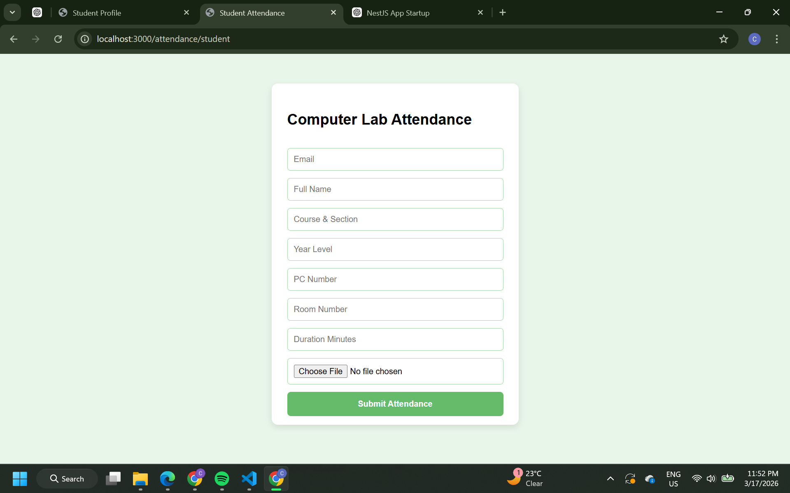
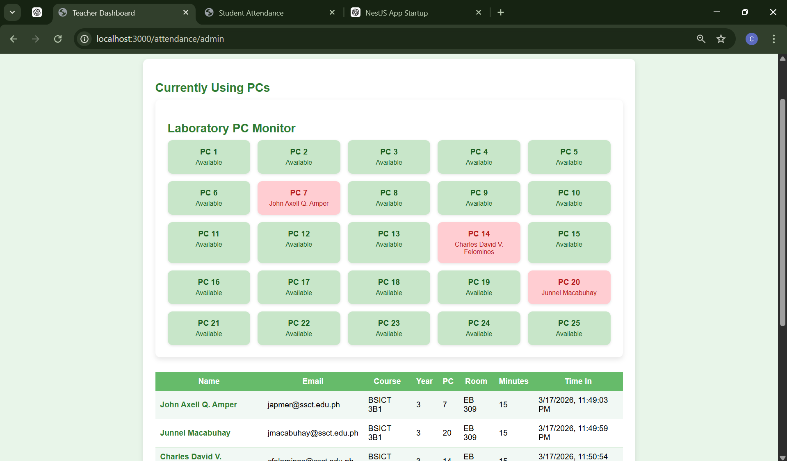
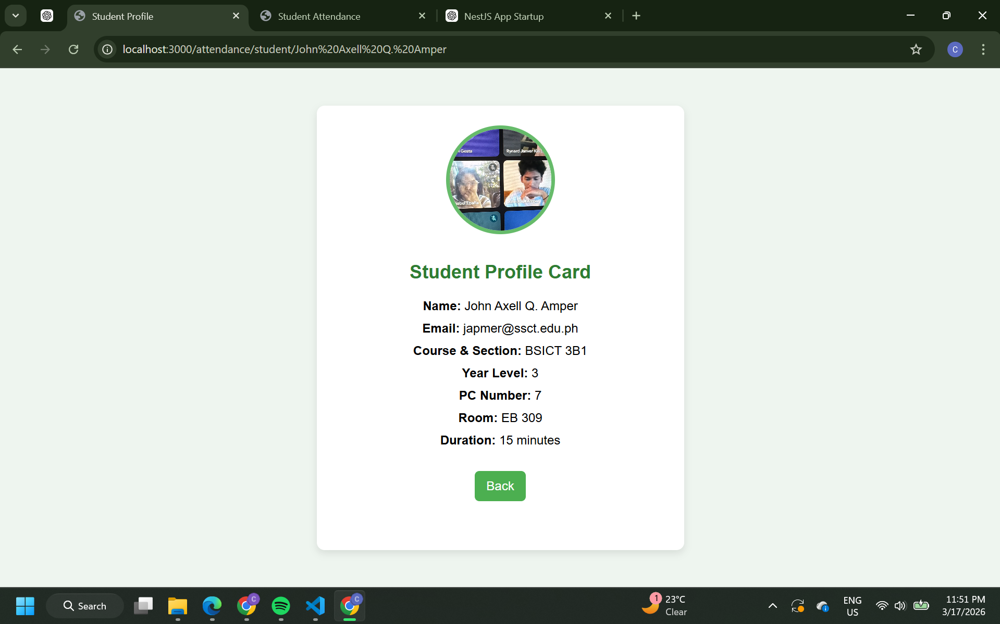
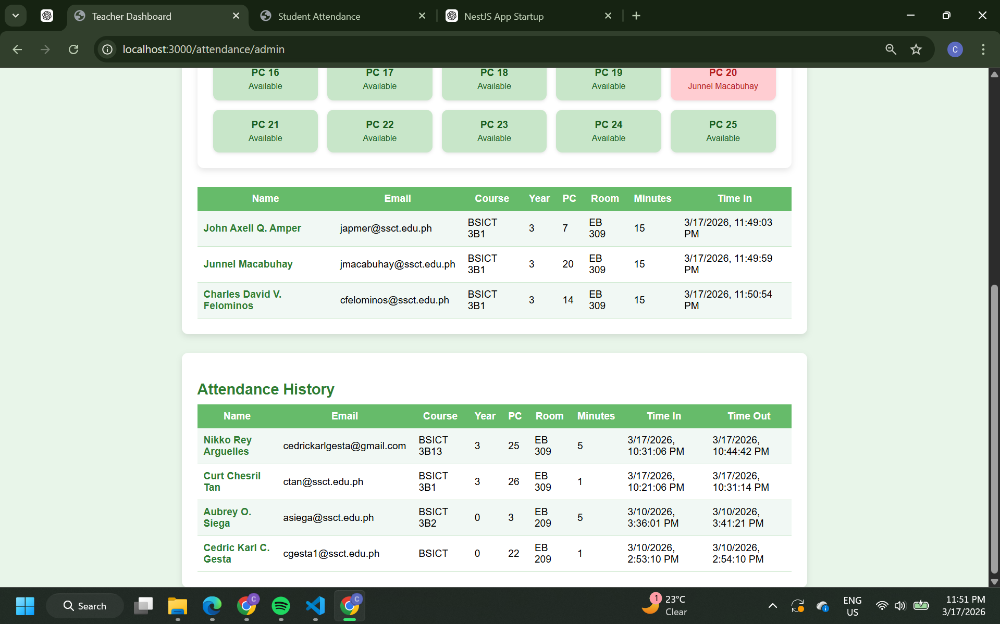

<p align="center">
  <a href="http://nestjs.com/" target="blank"></a>
</p>

# 🧪 Lab Attendance System

A web-based Computer Laboratory Attendance System built using **NestJS** that allows students to log their lab usage and enables teachers to monitor attendance in real-time.

---

## 👨‍🎓 Student Information

* **Name:** Cedric Karl Gesta
* **Application:** Lab Attendance Monitoring System

---

## 📌 Overview

This system is designed to manage student attendance in a computer laboratory.
Students can input their details, select a PC number, and specify usage duration.
Teachers can monitor active users and view attendance history.

---

## ⚙️ Features

### ✅ Core Features

* Student Attendance Form
* PC Assignment System
* Attendance Tracking (Time In / Time Out)
* Attendance History Table
* Teacher Dashboard View

---

## ✨ Added Features (Assignment Requirement)

### 🟢 Feature 1: Student Profile / ID Card

**Purpose:**
To display a detailed student profile after clicking their name in the attendance table.

**Expected Users:**
Teachers and students.

**Main Functionality:**

* Shows student information in a card layout
* Displays profile photo if uploaded
* Generates a letter avatar if no photo is provided

**Acceptance Criteria:**

* Clicking a student name opens their profile page
* Profile displays complete student information
* Profile photo is shown if available
* If no photo, a letter avatar is displayed

---

### 🟢 Feature 2: PC Availability Dashboard (Live Status)

**Purpose:**
To visually display which PCs are available or currently in use.

**Expected Users:**
Students and teachers.

**Main Functionality:**

* Shows all PC numbers (1–25)
* Highlights occupied PCs
* Highlights available PCs

**Acceptance Criteria:**

* Displays all 25 PCs
* Occupied PCs are visually different from available ones
* Updates based on current attendance data
* Helps prevent duplicate PC usage

---

## 🖥️ System Flow

1. Student fills up the attendance form
2. System validates input (PC availability, limits)
3. Student is recorded as active user
4. Data appears in "Currently Using PCs" table
5. Teacher monitors usage and history
6. Student profile can be viewed by clicking their name

---

## 🧰 Technologies Used

* **Backend:** NestJS
* **Frontend:** HTML, CSS
* **Language:** TypeScript
* **Server:** Node.js

---

## 📸 Screenshots

> (Insert screenshots before submission)

* 
* 
* 
* 

---

## 🚀 How to Run

```bash
npm install
npm run start
```

Then open:

```
http://localhost:3000/attendance
```

---

## 📌 Notes

* Maximum PC limit: 25
* Maximum duration: 500 minutes
* Year level allowed: up to Year 4
* Each PC can only be used by one student at a time

---

## ✅ Conclusion

The system successfully demonstrates a functional laboratory attendance monitoring system with enhanced features such as a student profile card and a PC availability dashboard, improving usability and system interaction.

---
